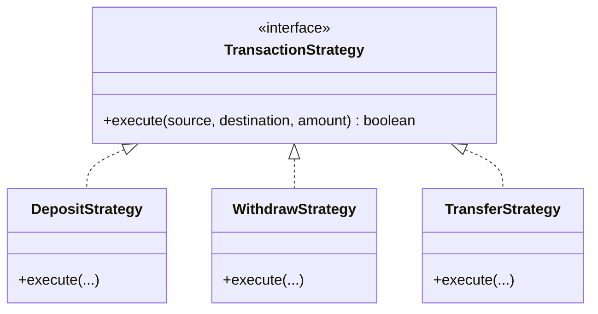
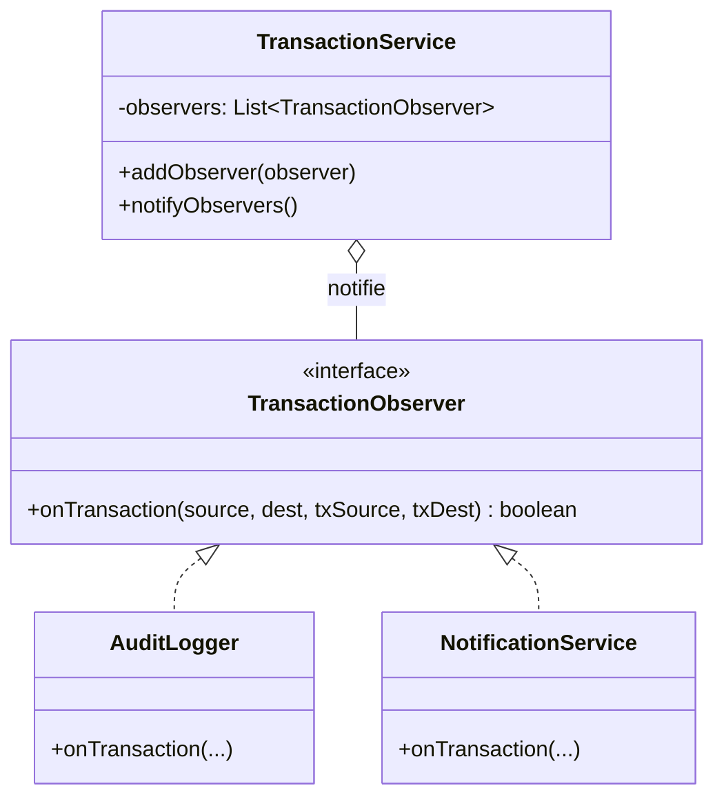

**Encadré par :** Pr. Walid BOUARIFI
**Réalisé par :**
- AHMAMO HAMZA
- AOURIR AISSAM
- HMIDDOUCH ABDESSADEK

---

# Rapport de Refactoring du Projet Finance App

## 1. Introduction : Assurance Qualité et Problématique du Code Spaghetti

Dans le développement logiciel, l'Assurance Qualité (QA) est primordiale pour garantir la fiabilité, la maintenabilité et l'évolutivité des applications. Un obstacle majeur à cette qualité est le "Code Spaghetti".

Le code spaghetti se caractérise par une structure de contrôle complexe et enchevêtrée, souvent monolithique, où la logique métier, l'interface utilisateur et la gestion des données sont mélangées. Comme observé dans la classe `SpaghettiFinanceApp.java` de ce projet, cela entraîne plusieurs problèmes critiques :

- **Maintenabilité difficile** : Une simple modification peut avoir des effets de bord imprévisibles.
- **Testabilité quasi-nulle** : Impossible de tester une fonctionnalité isolée sans exécuter toute l'application.
- **Duplication de code** : La logique (comme la journalisation) est répétée à plusieurs endroits.
- **Manque d'extensibilité** : Ajouter une nouvelle fonctionnalité (ex: un nouveau type de transaction) demande de modifier le cœur de l'application, augmentant le risque de bugs.

Ce projet a consisté à transformer cette base de code fragile en une architecture modulaire, robuste et testable en appliquant des principes de conception solides (SOLID) et des patrons de conception (Design Patterns).

## 2. Refactoring et Patrons de Conception (Design Patterns)

Nous avons découpé l'application monolithique en composants distincts. Voici les principaux patrons de conception utilisés :

### 2.1 Pattern Strategy (Stratégie)

**Problème** : Dans le code original, un grand `switch/case` gérait tous les types de transactions (Dépôt, Retrait, Transfert).
**Solution** : Le pattern Strategy permet d'encapsuler chaque algorithme de transaction dans une classe séparée implémentant une interface commune `TransactionStrategy`.

Cela permet d'ajouter de nouveaux types de transactions sans modifier le code existant (Respect du principe Open/Closed).

### 2.2 Pattern Observer (Observateur)

**Problème** : La journalisation (logging) et les notifications étaient mélangées à la logique métier des transactions.
**Solution** : Le pattern Observer permet de définir un mécanisme de souscription pour que des objets (les observateurs) soient notifiés d'un événement (une transaction).

Ainsi, `AuditLogger` ou `NotificationService` peuvent réagir à une transaction sans que la logique de transaction ne dépende d'eux.

### 2.3 Pattern Factory (Fabrique)

**Problème** : La création des objets `Account` et `User` était faite de manière ad-hoc, sans validation centralisée.
**Solution** : Le pattern Factory (`AccountFactory`, `UserFactory`) centralise la logique de création. Il garantit que les objets sont toujours créés dans un état valide (ex: pas de solde négatif à la création).

## 3. Intégration Continue (CI) et Qualité du Code

Pour assurer la pérennité de la qualité du code, nous avons mis en place un pipeline d'intégration continue.

### 3.1 Jenkins

Jenkins joue le rôle d'orchestrateur. Le fichier `Jenkinsfile` définit les étapes du pipeline :

1.  **Build** : Compilation du projet avec Maven (`mvn clean package`).
2.  **Test** : Exécution des tests unitaires (`mvn test`).

### 3.2 SonarQube

SonarQube est utilisé pour l'analyse statique du code. Configuré via `sonar-project.properties`, il scanne le code pour détecter :

- Les "Code Smells" (mauvaises pratiques).
- Les bugs potentiels.
- Les vulnérabilités de sécurité.
- La duplication de code.

### 3.3 JaCoCo (Java Code Coverage)

JaCoCo est un outil de couverture de code. Il s'intègre aux tests Maven pour mesurer quel pourcentage du code est réellement exécuté par les tests. SonarQube utilise ensuite le rapport généré (`jacoco.xml`) pour afficher le taux de couverture et empêcher la mise en production de code non testé.

## 4. Intégration Docker

Docker simplifie considérablement le déploiement de l'application en la "conteneurisant".

### 4.1 Dockerfile Multi-stage

Nous utilisons un `Dockerfile` "multi-stage" pour optimiser l'image finale :

1.  **Stage Build** : Utilise une image Maven complète pour compiler le projet et générer le `.jar`.
2.  **Stage Run** : Utilise une image JRE (Java Runtime Environment) légère, ne contenant que le nécessaire pour exécuter l'application. On y copie le `.jar` généré à l'étape précédente.

Cela permet d'avoir une image finale très légère et sécurisée (sans le code source ni les outils de compilation).

### 4.2 Docker Compose

Le fichier `docker-compose.yml` permet de définir et lancer l'application avec une simple commande. Il configure le mapping des ports (8080) et assure que l'environnement est identique, que ce soit sur la machine du développeur ou sur le serveur de production.
